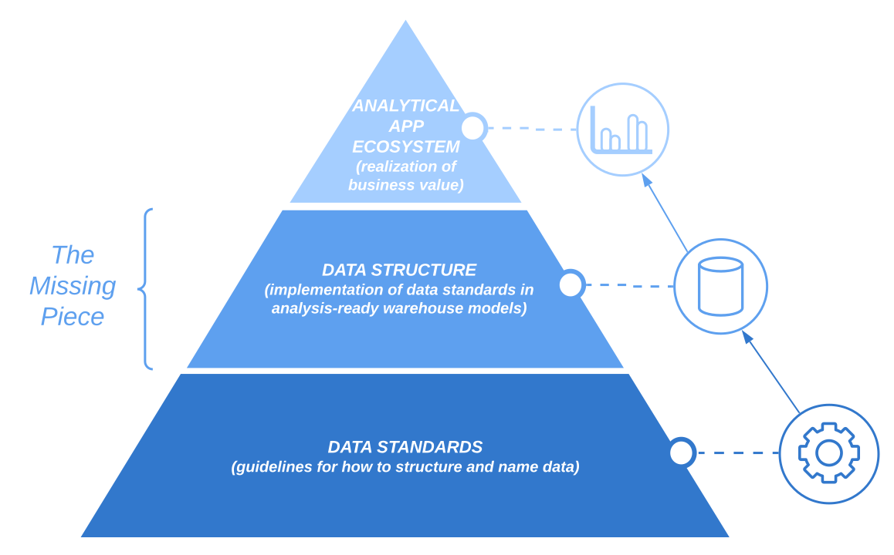
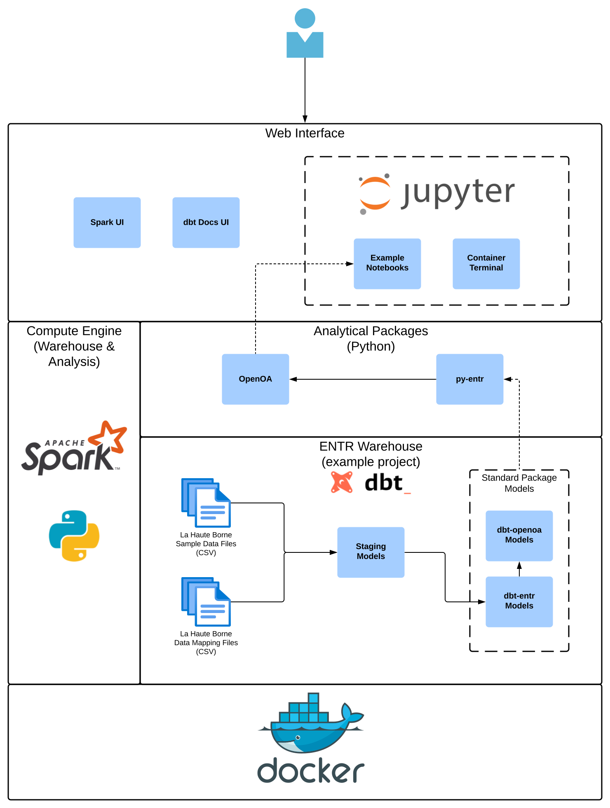

.. _overview:

.. ::

    # with overline, for parts
    * with overline, for chapters
    ^, for sections
    -, for subsections
    ^, for subsubsections
    ", for paragraphs

.. toctree::
   :maxdepth: 2

#############
ENTR Overview
#############

This section provides context about how the pieces of the ENTR data stack fit together and our motivations for building them.

************************
Background & Motivations
************************

   By standardizing how we structure and name data, we can standardize how we build analytical tools

Analytical tools, which ingest data and create an output that is useful for making business decisions, inherently cannot be built without defining how input data must be structured.
This limitation makes it exceedingly difficult to distribute analytical tools, and analysts, data engineers, and data scientists in the industry continue to sink the majority of their time into data preparation,
i.e. structuring, naming, and validating data to feed analytical products. Orchestrating data pipelines to feed these analytical tools and drive repeatable business process ultimately makes realizing the
value of these analytical tools even more difficult.

While standards like IEC 61400-5 provide a theoretical framework for standardizing data, more specific, methodological frameworks for implementing data standards at scale have been missing from the
open source community - the ENTR Foundation is leading the charge to remediate that critical point of failure.
Our stance is that we can provide the most effective implementation of data standardization by creating software that makes it easy to structure and name data within relational data stores.
Having well-defined tabular data then makes it easy to build, validate, and distribute analytical tools collaboratively because the structure of input data can be aligned.

************
Architecture
************

   The ENTR Runtime Docker image contains a reference implementation of the ENTR data stack showcasing how ENTR has made it feasible to distribute NREL's OpenOA (Open Operational Assessment) analytical methods

Data Warehousing Packages
^^^^^^^^^^^^^^^^^^^^^^^^^

We are leveraging data build tool (dbt) to ship data standards in relational data stores.

dbt-entr
^^^^^^^^
dbt-entr is an dbt package containing table schema (structural conventions) and tag names (naming conventions) to reduce the burden of data preparation for analysis.
These conventions enable a methodological implementation of data standards compatible with any relational data warehouse (visit our `CircleCI website <https://app.circleci.com/pipelines/github/entralliance/dbt-entr?branch^main>`_ to view the ones we've verified so far).
This package provides a stable foundation upon which the rest of the ENTR stack is built.

dbt-openoa
^^^^^^^^^^
dbt-openoa...

Analytical Packages
-------------------

The ENTR Foundation has developed the following packages in Python for analysis.

`OpenOA <https://github.com/entralliance/OpenOA>`_
^^^^^^^^^^^^^^^^^^^^^^^^^^^^^^^^^^^^^^^^^^^^^^^^^^

OpenOA (Open Operational Assessment) is used within the ENTR environment to perform operational assessments of wind plants using data stored in the ENTR warehouse.
OpenOA consists of modules for organizing different types of data
(e.g., revenue meter, SCADA, meteorological tower, and reanalysis),
low-level data analysis toolkits (e.g., filtering, power curve fitting),
and high-level operational assessment methods (such as long-term energy production estimation).
OpenOA is maintained and primarily developed by the National Renewable Energy laboratory (`more information <https://www.nrel.gov/wind/openoa.html>`_).

`py-entr <https://github.com/entralliance/py-entr>`_
^^^^^^^^^^^^^^^^^^^^^^^^^^^^^^^^^^^^^^^^^^^^^^^^^^^^

In addition to OpenOA, the entr_runtime distributes a python package called `entr`,
which provides connection classes to interface with and query from the built-in Spark ENTR warehouse,
as well as a constructor for OpenOA which facilitates the creation of OpenOA PlantData objects using ENTR data.

Example Implementation Environments
-----------------------------------

The `ENTR Warehouse <https://github.com/entralliance/entr_warehouse>`_
^^^^^^^^^^^^^^^^^^^^^^^^^^^^^^^^^^^^^^^^^^^^^^^^^^^^^^^^^^^^^^^^^^^^^^
The ENTR Warehouse provides template Data Build Tool (dbt) macros and scripts to assist in building and orchestrating a data warehouse for operational wind plant data. (`dbt <https://www.getdbt.com>`_ is an open-source command-line tool designed to build and run data transformations in a data warehouse.)
The ENTR warehouse provides an open foundation for data analysis, on which methods can be built and standardized.
The warehouse materializes database objects in the Spark database provided by the ENTR runtime for each type of wind plant data
(e.g., supervisory control and data acquisition (SCADA), revenue meter), using the standard ENTR data model,
which includes data transformations and table schema.

The `ENTR Runtime <https://github.com/entralliance/entr_runtime>`_
^^^^^^^^^^^^^^^^^^^^^^^^^^^^^^^^^^^^^^^^^^^^^^^^^^^^^^^^^^^^^^^^^^
The ENTR runtime is a distribution of 
tools, frameworks, and standards relevant to renewable energy data analysis,
packaged together in a Docker container to enable efficient and reproducible analysis workflows. The ENTR runtime is managed by the `ENTR Foundation <https://www.entrfoundation.org>`_ initiative. Currently, the ENTR
runtime is designed for wind energy data, but other technologies are planned for future releases (e.g., solar, battery storage).
The ENTR runtime is based on Jupyter's Spark Notebook container, and includes the ENTR warehouse, the OpenOA operational analysis Python package, and example data.
The runtime containerizes the required set of software to run the ENTR warehouse and OpenOA methods within a single environment,
and it provides a sandbox environment enabling analysts and developers in the ENTR ecosystem to get started quickly.
For example, analysts can perform operational assessments with OpenOA using example wind plant data,
and developers can start customizing data transformations in the ENTR warehouse.

The ENTR runtime is implemented as a Docker container (`hosted here <https://ghcr.io/entralliance/entr_runtime>`_), providing a unified analysis environment in which the ENTR environment can be deployed in a “write once, run anywhere” and platform-independent way.
(`Docker <https://www.docker.com>`_ is a cross-platform containerization software that has become the de facto standard for
deploying self-contained software environments and services for virtually any computer application.)

